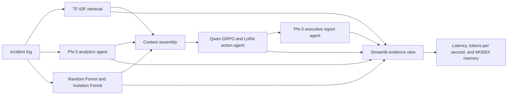

# Technical Architecture

## Component responsibilities

| Component | Purpose | Evidence |
|---|---|---|
| Analytics Agent | Produces category, severity, and impact JSON. | Validated structured output. |
| Prediction Agent | Estimates risk and anomaly status. | Held-out accuracy, macro-F1, confusion matrix. |
| Retrieval | Finds related resolved incidents without an external service. | Risk/severity Recall@3 plus category recall when represented in train. |
| Action Agent | Generates three remediation horizons. | Base-vs-GRPO held-out evaluation. |
| Report Agent | Converts technical output into an executive summary. | Demo output and latency. |
| Coordinator | Orchestrates agents and records performance. | End-to-end benchmark JSON. |

## AMD usage

PyTorch exposes AMD ROCm devices through the `torch.cuda` API. The project
records `torch.version.hip`, the GPU model, output tokens per second, end-to-end
latency, and peak allocated GPU memory. These values are generated in the AMD
environment rather than hard-coded.

## Data boundaries

- Train: GRPO rewards, risk/anomaly fitting, and retrieval corpus.
- Test: evaluation scripts only.
- Production input: never added to training or retrieval automatically.

This prevents the original evaluation leakage where generated answers were
compared with examples already used during model training.
